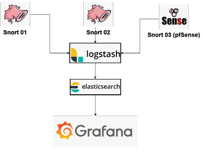
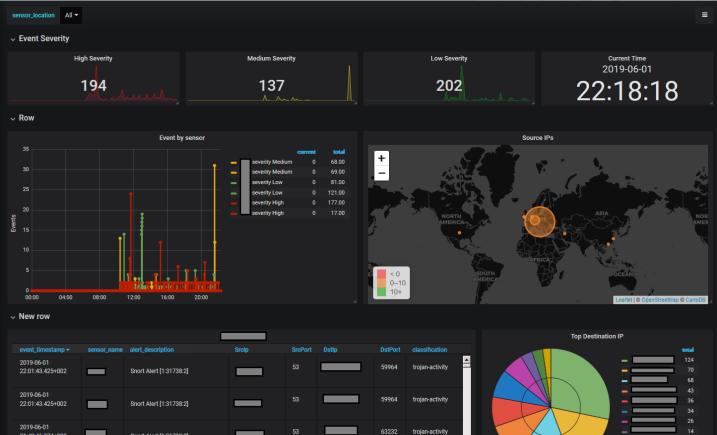
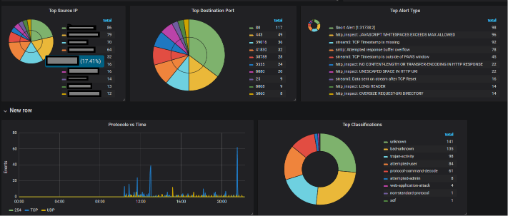
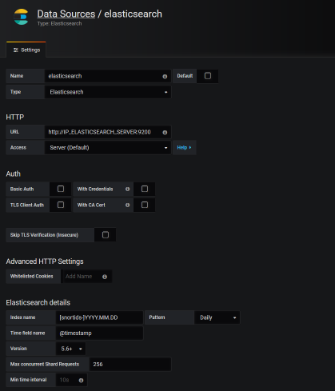

<h2>Snort2 grafana dashboard</h2>

While some IDS/IPS systems still wait for upgrade to Snort3 where JSON logging is available (or Suricata) it may be useful give elasticity of logs handling given by Elasticsearch and Grafana for Snort2

Project is based on existing grafana security dashboard [Security center](https://grafana.com/dashboards/3099)
but removes existing hard-coded dependencies and provides all configuration details for Snort, Barnyard2, Elasticsearch and Grafana.

This tag works with ELK stack version 6.5

Logs flow and components:

<h4>Example dashboards:</h4>

<b>Snort configuration:</b>
Snort uses "-l" configuration inside systemd service definition to inform what is the log output directory.

<b>Barnyard2 configuration:</b>

Barnyard2 takes files from snort and sends them via UDP protocol to Logstash server listening to 5142 udp port

<b>Logstash:</b>

Logstash listen to 5142 and all logs marks with "snort" tag.
Tagged "snort" logs are treated with grok and later some transformation.
Output for snort log is set to elasticsearch and index name like snortids-%YY-%MM-%dd

<b>Grafana:</b>

Just connects to defined Elasticsearch clusters:

Elasticsearch datasource definition (before importing Grafana dashboard):

